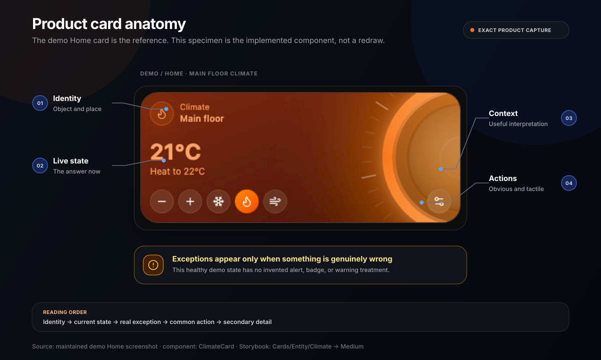

Navet's cards are a core brand signature. They are not a generic bento-grid style applied after the
product is designed; they are how Navet turns household state into a calm, tactile, recognizable
language.

This document defines that language. It does not replace component APIs, design tokens, feature
stories, or implementation guidance. For implementation, use:

- [Navet UI guidelines](https://github.com/awesomestvi/navet/blob/main/docs/design-system/UI-GUIDELINES.md)
- [AI design context](https://github.com/awesomestvi/navet/blob/main/docs/design-system/AI-DESIGN-CONTEXT.md)
- Storybook's `Components/Primitives/Cards/BaseCard` and `Cards/Overview/*` surfaces
- the exact neighboring feature card and its stories

## The Signature

A Navet card combines four qualities:

1. **Immediate identity** — the person understands what object, place, or household information
   the card represents.
2. **Live state hierarchy** — the current value or exception is visible before supporting detail.
3. **Tactile directness** — the common action is obvious and usable on a wall panel, tablet, phone,
   or desktop.
4. **State-led expression** — neutral structure stays quiet while device, content, semantic, and
   user-accent color communicate what is happening.

The Home cards in the public demo are the primary visual reference. Their combination of compact
geometry, strong live values, circular controls, and state-specific color is part of how Navet
speaks. Do not neutralize them into generic monochrome tiles, and do not turn their color into an
arbitrary decorative palette.

## What A Card Says

Cards communicate with more than copy:

| Signal | What it says |
| --- | --- |
| Neutral shell | This object is available but not demanding attention |
| State or device tint | This object is active, and this is its real or selected character |
| Large metric | This value is the main thing to know now |
| Icon pill | This is the object type or state anchor |
| Circular or pill control | This can be acted on directly |
| Artwork or condition scene | This content or environment is the current context |
| Fine border and restrained depth | This belongs to the current theme and grid |
| Short status language | This is what the household needs to know, without system jargon |

Every visible element must help identify, understand, or control the card. Empty decoration makes
the language less clear.

## Reading Order

A card should usually read in this order:

1. object or widget identity
2. current state or primary value
3. exception, warning, or availability
4. primary household action
5. secondary detail and configuration

The visual order may move elements around for a card size, but it must preserve this information
priority. A large decorative gauge must not make the device name or current state harder to find.

## Anatomy

### Identity zone

The identity zone normally contains an entity or feature icon, a specific name, and a short type,
room, or category label. It should remain recognizable when the rest of the card is visually busy.

- Prefer names people use in the home: “Kitchen island,” “Front door,” “Living room speaker.”
- Use the provider name only when provider identity changes the decision or action.
- Keep the icon treatment consistent with neighboring cards.
- Truncate or adapt long names without letting controls drift out of alignment.

### State zone

The state zone is the card's primary answer: `64%`, `21°C`, `Locked`, `Playing`, `Home`, or another
plain household state.

- Give a live metric enough weight to be read at a glance.
- Pair ambiguous values with a short label or unit.
- Distinguish state from configuration; “Heat to 22°C” is different from current temperature.
- Keep unavailable, stale, or failed data explicit instead of presenting a plausible old value as
  current.

### Action zone

The action zone contains the most common safe action and, where space allows, a small group of
closely related controls.

- Keep one obvious primary control path.
- Do not duplicate the same action in the card body, footer, and overflow menu.
- Use direct manipulation when the object makes it natural: a slider, transport control, stepper,
  or deliberate security action.
- Put setup, advanced options, and rarely used commands in the established dialog or sheet.
- Consequential security actions must remain deliberate and clearly labeled.

### Context zone

Context can include artwork, a forecast, a trend, a schedule, a secondary sensor, or a room cue.
It earns space only when it helps someone interpret the current state.

### Settings and edit affordances

Settings and size controls are secondary. They appear through the shared edit, dialog, or overflow
patterns and must not compete with normal household control.

## Surface Grammar

### One family, many states

Neighboring cards share a theme-native shell, geometry, border language, and density. Individual
cards then express their state inside that family.

- `glass` may use frosted or translucent material.
- `dark` uses opaque near-black surfaces and restrained depth.
- `light` uses warm canvas, white/slate surfaces, and quiet shadow.
- `black` uses true-black surfaces and minimal decoration.

Do not give one feature a different material language merely because its domain has a strong
color. State treatment layers on the inherited shell; it does not replace the dashboard's theme.

### Geometry

The shared card shell currently uses the inset-panel radius role and compact internal gaps. The
precise classes, padding, spans, and responsive metrics belong to shared tokens and `BaseCard`, not
to this brand guide.

The recognizable result is:

- rounded rectangular modules with consistent corner character
- compact but calm insets
- aligned content anchors across a mixed grid
- circular and pill controls that read as touchable
- one coherent surface rather than nested card borders

Do not create a feature-local shell, radius, or grid recipe when the existing primitive can express
the behavior.

### Depth

Depth is quiet and theme-aware. A fine border, inset highlight, controlled shadow, or low-opacity
glow is usually enough. Only the `glass` theme should read as frosted material. Avoid stacked
drop-shadows, heavy blur on every card, and glossy overlays that obscure data.

## Color Authority

Card color follows a specific hierarchy:

1. safety or semantic meaning
2. explicit device state or content-derived color
3. user-selected dashboard accent as a fallback
4. neutral inactive surface

Corporate orange is not an extra layer in this hierarchy. It appears in a card only when orange is
the user's accent, the device or domain legitimately resolves to orange, or a small explicitly
Navet-branded element is present.

### Explicit device color

If a light or other device has a meaningful current color, that color is authoritative for its
active treatment. Preserve readable foregrounds and theme character rather than replacing it with
the dashboard accent.

### User accent fallback

If an active entity has no meaningful color of its own, use the selected dashboard accent through
the shared active-surface recipe. The default accent happens to be Navet orange, but a blue, teal,
purple, or custom accent must work equally well.

### Content-derived color

Media artwork, photography, maps, and weather scenes may provide local color. Derive a readable,
stable palette and keep it contained to the card or related detail surface. When imagery is missing
or palette extraction is reduced for performance, fall back to the theme's neutral content palette.

### Semantic color

Success, warning, error, and information colors keep their meaning. Use them to identify the
specific status or exception, not as decorative card themes. Pair color with copy, iconography, or
structure.

### Inactive color

Inactive cards return to the shared neutral surface. Do not leave an “off” card looking brightly
active. Preserve enough contrast that it remains identifiable and usable.

## State Grammar

| State | Visual behavior | Content behavior |
| --- | --- | --- |
| Inactive or off | Neutral theme surface; subdued but readable icon and secondary content | Name and state remain visible; primary action remains discoverable |
| Active | Device, content, or accent color layers onto the theme; foreground recalculates for readability | Show the current value and active action without celebratory copy |
| Changing | Keep geometry stable; use immediate control feedback and a short transition | Reflect the requested state without hiding the object identity |
| Loading | Preserve the final footprint and major anchors | Use concise progress only when it helps; do not show invented values |
| Unavailable | Reduce nonessential imagery and make availability explicit | Say “Unavailable” or the established equivalent; do not imply the device is off |
| Warning | Use the shared warning treatment at the relevant element or card level | State what needs attention and the safe next action |
| Error | Use the shared error treatment without replacing useful context | Explain what failed and how to recover when recovery is known |
| Empty | Keep the surface calm and directional | State what is missing and give the next useful action |

State cannot depend on color or motion alone. Text, icon, control state, and accessible name must
agree.

## Size Grammar

Every supported card size is a composition, not a scaled or clipped desktop card.

| Size | Communication job |
| --- | --- |
| Tiny | Identity plus one unmistakable state signal |
| Extra-small | Identity plus one compact value or binary state |
| Small | A complete single-purpose control or glanceable status |
| Medium | Identity, strong state/value, and a useful primary control group |
| Medium-vertical | A deeper vertical interaction or richer sequence without widening the lane |
| Large | Rich data, media, forecast, schedule, or multi-step control with clear zones |
| Extra-large | A broad information surface whose content genuinely benefits from the width |

Rules across sizes:

- Remove or move secondary content before shrinking primary content below usefulness.
- Keep the same object identity and action name across breakpoints.
- Preserve touch targets even when visible information is compact.
- Do not hide critical state in a dialog just to make a small card fit.
- Do not make every card large; mixed size is useful only when importance and content warrant it.
- Extra-large cards collapse to an intentional smaller composition when the grid cannot support
  their span.

Use the current card-size and grid utilities for exact spans and measurements.

## Card Families

Different household objects speak through the same grammar with domain-specific emphasis.

### Lights, switches, fans, scenes

- Lead with identity and on/off or running state.
- Use a real device color when available; otherwise use the user accent for active state.
- Keep brightness, speed, or presets secondary to the basic state.
- Whole-card activation is appropriate only when nested controls remain unambiguous.

### Climate and humidity

- Make current and target values unmistakably different.
- Let the active mode or action influence color through the established climate recipe.
- Use gauges as direct controls and state explanations, not ornamental dials.
- Keep units, range, and step behavior consistent with user settings.

### Media

- Let artwork and title/artist identify the content.
- Keep transport controls familiar and immediately accessible.
- Use the extracted artwork palette locally; use a neutral palette when artwork is absent.
- Preserve speaker, TV, receiver, source, and grouping context without crowding the primary content.

### Security

- Prioritize locked, unlocked, armed, open, or alert state over decoration.
- Give dangerous or consequential actions deliberate interaction and clear labels.
- Use semantic warning/error treatment for actual risk, not to make every security card feel urgent.
- Avoid fear-based imagery and false reassurance.

### Weather and environment

- Use condition-led imagery and color as information.
- Keep location, current condition, temperature, and forecast hierarchy readable over the scene.
- Show only the environmental metrics that help interpret the current condition at that size.

### People and presence

- Lead with the person's name and a plain presence or location state.
- Keep portraits or avatars supportive, not surveillance-like.
- Treat unavailable location as unknown, not away.

### Sensors, energy, schedules, and information widgets

- Lead with the current value, next event, or meaningful exception.
- Use charts and tables only when the pattern changes the decision.
- Keep scales, units, time ranges, and update context legible.
- Prefer neutral structure with focused semantic emphasis over a different color for every row.

### Cameras and photographs

- Let the image be the content while keeping controls and state readable.
- Handle missing, stale, unavailable, or unauthorized imagery explicitly.
- Use real demo-safe imagery in public materials; never expose a private feed.

## Tactility And Interaction

Navet cards are designed for mixed-input homes.

- Controls must read as controls without hover.
- Focusable card controls use the shared Navet scale: 36 px compact minimum, 40 px standard, and
  42 px only when extra separation or emphasis is genuinely needed.
- Visible pressed, selected, focus, disabled, and unavailable states are required.
- Keyboard focus follows a logical order and is never clipped by the card shell.
- Drag or edit behavior must not steal taps, scrolling, sliders, or nested media interaction.
- A whole-card action must not make nested buttons trigger the same command accidentally.
- Keep configuration behind progressive disclosure while leaving useful state visible.

The tactile character comes from geometry, feedback, and reliable response—not from making every
control look three-dimensional.

## Card Voice

Card copy is short household language. It names what a person recognizes and what is true now.

Prefer:

- `Kitchen island`
- `Brightness`
- `64%`
- `Heat to 22°C`
- `Locked`
- `Slide to unlock`
- `Morning mix`
- `No alerts`

Avoid:

- `Entity light.kitchen_island is currently active`
- `Device operational state`
- `Execute unlock service`
- `Success! Your light has been turned on`
- invented subtitles such as `Smart comfort` that add mood but no meaning

Use sentence case and the translation system. Keep the same action name through control, progress,
and confirmation. Errors identify what happened and the recovery action when known.

## Motion And Effects

Operational card motion may:

- confirm a state change
- show a slider, gauge, cover, or progress relationship
- connect a card to its dialog or sheet
- update media progress without causing layout movement

It must not:

- run ambient animation on every visible card
- make live values jump or reflow unnecessarily
- delay the primary action
- use a glow pulse as the only indication of an alert
- assume high effects quality

Cards must remain complete with reduced motion, low effects quality, no hover, and missing imagery.

## Operational And Expressive Use

### Dashboard

Home is the canonical reference for outer spacing, section rhythm, grid density, and responsive
behavior. A more specific neighboring feature card wins for its own component family.

The dashboard uses cards as live operational objects. Do not borrow marketing section spacing,
hero type, or ambient page effects for a dashboard lane.

### Demo

The public demo is the real product running on provider-free sample data. It should use the same
cards, states, themes, and responsive behavior as a connected Navet installation. Do not add a
promotional skin to the demo cards.

### Marketing and social

Marketing may arrange real cards into a focused product preview or moving sequence. The current
marketing preview deliberately imports the actual card components instead of creating a parallel
mock-card system.

- Keep preview data realistic and capability-accurate.
- Preserve the card's real geometry, state treatment, and content hierarchy.
- Make noninteractive previews inert and do not suggest controls can be used.
- Use captured demo screenshots when showing a full dashboard.
- A crop may focus attention, but it must not manufacture a card state or remove essential context.
- The expressive composition may move; the cards themselves should not acquire decorative motion.

### Documentation and Storybook

Docs may show a focused card example, but implementation truth belongs in Storybook. Storybook
must cover real supported sizes, states, themes, and meaningful missing-data cases rather than only
an ideal showcase.

## Do And Do Not

| Do | Do not |
| --- | --- |
| Treat the existing demo cards as a defining brand expression | Replace them with generic monochrome SaaS tiles |
| Let active device state create local color | Assign random colors merely to make a bento grid lively |
| Return inactive cards to a shared neutral family | Leave off cards looking as vivid as active cards |
| Use the user accent when no more meaningful color exists | Force corporate orange over a selected blue accent |
| Keep identity, state, and primary action visible | Fill compact cards with descriptions, badges, and settings |
| Adapt each supported size intentionally | Scale a large card down until text and controls clip |
| Use one coherent theme-native shell | Give each feature a separate glass, gradient, and shadow recipe |
| Use artwork and weather scenes as information | Add decorative imagery unrelated to current content |
| Put advanced configuration in a dialog or sheet | Nest a settings panel inside an operational card |
| Show explicit unavailable, loading, and error states | Present stale or invented values as live data |
| Preserve the 36 / 40 / 42 px interaction scale and visible focus | Depend on hover or controls smaller than the shared compact minimum |
| Use actual card components and demo captures in marketing | Draw fake cards that cannot exist in the product |

## Extension Workflow

Before adding or reshaping a card:

1. Inspect the exact target screen and immediate neighboring cards.
2. Name the primary reference; use Home only when no closer component-family reference exists.
3. Inspect `BaseCard`, the nearest primitive or pattern story, and the feature's current stories.
4. State the information priority, primary action, supported sizes, responsive change, and color
   authority.
5. Reuse or extend an established recipe. A new recipe requires a concrete product reason.
6. Review normal, active, unavailable, loading, empty, and error states that the feature supports.
7. Review every supported size across `glass`, `dark`, `light`, and `black`.
8. Check touch, keyboard focus, no-hover use, reduced motion, and reduced effects.
9. Test realistic long names, translated copy, missing artwork, and missing optional values.
10. Compare the rendered result with its named Navet reference before handoff.

## Definition Of A Navet Card

A card is ready when someone can identify it, understand its current state, and find the common
action at a glance; when its color has a semantic or source-based reason; when it belongs to the
same theme and grid as its neighbors; and when it remains clear across supported sizes, inputs,
effects levels, and failure states.

If a card is visually impressive but cannot meet those conditions, it is not yet speaking Navet.
