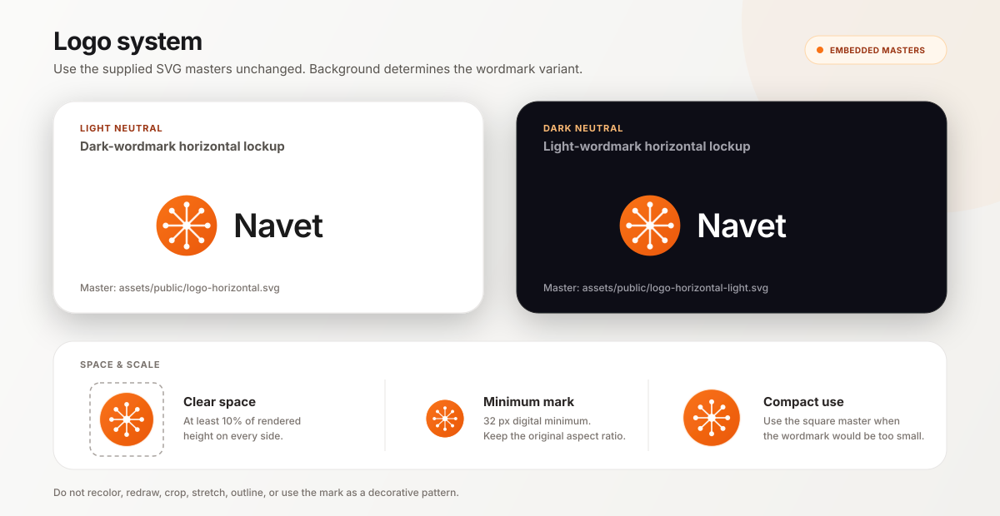
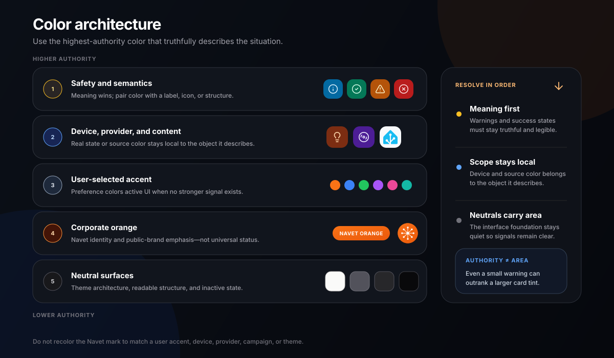

This document codifies Navet's established visual identity. It does not redesign the brand.

The primary references are:

1. the current Navet product and the provider-free demo for operational UI
2. [navet.app](https://navet.app/) for expressive product storytelling
3. [docs.navet.app](https://docs.navet.app/) for editorial and documentation expression

Use this guide to decide how Navet should look across product, website, documentation, release
graphics, social media, presentations, and partner materials. Use the
[UI guidelines](https://github.com/awesomestvi/navet/blob/main/docs/design-system/UI-GUIDELINES.md) and Storybook for component implementation.

## Identity In One Sentence

Navet is a calm, luminous, tactile control layer for the home: neutral architecture gives live
state, real devices, and the household's content room to speak.

The identity comes from the combination of:

- the orange hub mark
- near-black, white, and slate neutral surfaces
- restrained amber and blue atmosphere
- compact system typography with strong state hierarchy
- rounded modular geometry and pill-shaped controls
- real Navet cards, screenshots, and warm home imagery
- purposeful motion that respects the device and the user

No one item is the brand by itself. In particular, applying orange to every surface does not make
an experience more recognizably Navet.

## Preservation Rules

These decisions are established and should be preserved:

- the hub mark and its eight connected outer nodes
- the orange logo gradient from `#f97316` to `#ea580c`
- the name `Navet`, with its current capitalization
- the system sans-serif typography direction
- the four product themes: `glass`, `dark`, `light`, and `black`
- rounded, compact, tactile product geometry
- user-selectable accent color
- semantic and source-derived color in cards
- warm home photography paired with real product imagery
- orange-and-blue atmospheric light on website and docs surfaces

Do not introduce a new logo, font family, brand palette, radius system, or decorative visual
language under the banner of "refreshing" the identity. A foundation change requires an explicit
brand review, not a feature-level design decision.

## Modes Of Expression

Navet has one identity with different levels of expression. Do not apply the same amount of
atmosphere everywhere.

| Context | Primary job | Expression | Restraint |
| --- | --- | --- | --- |
| Operational product | Make live state and action immediately clear | Theme-native neutral surfaces, user accent, semantic state, device and content color | Decoration never outranks state; effects adapt to performance |
| Demo | Show the real product without requiring a provider | The actual product, realistic sample data, and normal product behavior | No special "demo skin" and no fabricated capabilities |
| Documentation | Help people understand and complete a task | Quiet product-like surfaces, strong type hierarchy, orange and blue atmosphere | Content remains the foreground; animation is ambient and optional |
| Marketing | Show the product's value and place it in the home | Warm room imagery, real Navet screens, larger typography, focused atmospheric light | One expressive moment at a time; no invented UI |
| Social and release graphics | Make Navet recognizable at a glance | Hub mark, concise outcome, real product proof, warm-dark composition | Avoid dense copy, generic technology motifs, and logo repetition |
| Partner and provider material | Explain a relationship accurately | Separate marks at balanced optical weight, clear relationship label | Never merge marks, borrow a provider palette as Navet's, or imply equal capability |

Operational surfaces are the strictest. Marketing may amplify established characteristics, but it
must not invent a parallel brand or make the product look unlike the demo.

## Logo System

### Approved marks

Use the supplied masters in [`assets/public`](https://github.com/awesomestvi/navet/blob/main/assets/public/README.md):

- `logo.svg` — primary square hub mark
- `logo-horizontal.svg` — hub mark with dark wordmark for light backgrounds
- `logo-horizontal-light.svg` — hub mark with light wordmark for dark backgrounds
- `favicon.svg` and `favicon-32x32.svg` — small browser applications
- generated PWA and touch icons — installation surfaces



The asset is the authority. Do not reconstruct the lockup by typing “Navet” beside the mark.
Portable reference specimens embed the complete approved master as data, and the asset manifest
locks the rendered specimen checksum; they do not rebuild its geometry or wordmark.

### Meaning

The center node represents Navet as the household control point. Eight radiating connections
represent the devices, services, and spaces brought into one interface. This story can support an
introduction to the brand, but it should not be repeated as decoration or copy on every surface.

### Color and background

- Keep the orange gradient, white hub lines, and white nodes unchanged.
- Use the dark-wordmark lockup on light neutral backgrounds.
- Use the light-wordmark lockup on dark neutral backgrounds.
- Place the square mark on quiet neutral or photographic areas with enough contrast.
- If a photograph is visually busy, use a calm crop or a neutral holding surface; do not add an
  outline or shadow to rescue the logo.
- Do not recolor the mark to match a user accent, provider, feature, campaign, or theme.

### Space and size

Keep clear space around the logo equal to at least 10% of the rendered logo height on every side.
More space is preferred in editorial and campaign layouts.

- The square mark must remain at least 32 px in digital UI.
- Use the horizontal lockup only when its wordmark remains comfortably readable; at compact sizes,
  use the square mark instead.
- Do not squeeze the lockup into a fixed-width slot or crop the outer circle.
- Favicons and app icons must use their purpose-built assets, not a scaled screenshot or lockup.

### Placement

Prefer one clear brand anchor per composition. On website and docs headers, the lockup begins the
navigation. On social graphics, place it away from the main message and product proof. Do not use
the mark as a pattern, watermark, bullet, or decorative background object.

### Co-branding

When Navet appears with Home Assistant, Homey, openHAB, or another provider:

- keep every mark in its original colors
- balance optical weight rather than forcing identical bounding boxes
- separate marks with space or a quiet divider
- use plain relationship language such as “Works with” or “Install for”
- never join marks into a new symbol or put provider spokes inside the Navet mark
- never use provider color as the Navet corporate color

## Color Architecture

Navet uses color in distinct layers. Their roles must not be collapsed into one palette.



### 1. Corporate orange

| Role | Value | Use |
| --- | --- | --- |
| Navet orange | `#f97316` | Primary brand anchor, mark start, selected public-brand emphasis |
| Navet deep orange | `#ea580c` | Mark end, supporting brand depth, accessible orange application |

The orange gradient is locked for the logo. Elsewhere, orange may appear as a solid, tint, border,
focus treatment, or restrained glow when the context is explicitly Navet-branded.

Corporate orange is appropriate for:

- the logo and favicon
- a primary marketing action
- selected navigation or documentation emphasis
- small identity details in release and social graphics
- a default accent preview when no user preference exists

Corporate orange is not a universal status color, a replacement for all links, or the default
background for every card.

### 2. User accent

The dashboard accent is chosen by the user. Orange is the default, but the accent is a product
preference—not a mutation of the Navet logo.

Current presets are:

| Name | Value |
| --- | --- |
| Orange | `#f97316` |
| Blue | `#3b82f6` |
| Green | `#22c55e` |
| Purple | `#a855f7` |
| Pink | `#ec4899` |
| Red | `#ef4444` |
| Yellow | `#eab308` |
| Teal | `#14b8a6` |

A custom accent is also supported. The active accent may color selected navigation, primary
controls, focus treatment, neutral active cards, and other user-personalized emphasis. It must not
recolor the corporate mark or override a real device, content, or safety color.

### 3. Semantic and status color

Semantic colors communicate meaning and keep that meaning across features:

| Meaning | Color family | Examples |
| --- | --- | --- |
| Information | Sky | Connection detail, explanatory state |
| Success | Emerald | Completed, connected, healthy |
| Warning | Amber | Attention needed, degraded state |
| Error or destructive | Red | Failure, unsafe state, destructive action |

Use the shared semantic tokens, including their theme-appropriate border, background, and text
treatments. Do not use corporate orange for an error merely because it is the brand color. Pair
semantic color with an icon, label, structure, or message so meaning never depends on color alone.

### 4. Device, provider, and content color

Color derived from the thing being represented is evidence, not decoration:

- a light's actual selected color may drive its active card
- media artwork may supply a local palette for that media surface
- weather condition art and color may describe the current environment
- a camera or photograph should keep the image's own color
- a provider logo keeps the provider's approved brand color when identifying that provider
- domain defaults may distinguish device families when no more specific color exists

Source-derived color stays local to the object it describes. Do not spread an album palette across
the whole dashboard or use a provider color as the page theme.

### 5. Neutral surfaces

Neutral surfaces are the architecture that lets state color remain meaningful.

| Theme | Character | Surface rule |
| --- | --- | --- |
| `glass` | Frosted, wallpaper-aware, luminous | The only product theme that uses translucent and frosted card material |
| `dark` | Warm-neutral near-black with restrained depth | Opaque dark cards, fine zinc borders, controlled gradients |
| `light` | Warm canvas with white and slate surfaces | High text contrast, quiet shadow, restrained tint |
| `black` | True-black, high-contrast, low-decoration | Black surfaces, very fine light borders, minimal shadow |

Inactive cards return to their theme's neutral surface family. `dark` and `black` must not become
glass variants. `light` must not become a field of pastel cards. Neighboring cards inherit one
surface family before expressing individual state.

### Color priority

When colors compete, use this order:

1. safety and semantic meaning
2. explicit device state or content-derived color
3. user-selected accent
4. corporate orange in a brand context
5. neutral surface

The order describes authority, not visual area. A warning may be a small but unmistakable element;
it does not need to flood the whole card.

### Atmospheric color

The website and docs use low-opacity amber/orange and blue light over neutral canvases. This pairing
suggests a warm home and connected digital control without turning the interface into a rainbow.

Use atmosphere to establish depth at the composition level. Do not add a separate glowing gradient
to every section. Avoid neon cyber palettes, purple-blue SaaS gradients, and unrelated iridescence.

## Typography

### Family

Navet uses the native system sans-serif stack:

```css
ui-sans-serif, system-ui, -apple-system, BlinkMacSystemFont, "Segoe UI", sans-serif
```

Technical content uses the established system monospace stack. Do not introduce a display font or
replace the product stack for a campaign. Navet's personality comes from scale, weight, spacing,
and restraint rather than a novelty typeface.

### Operational typography

- Use shared typography roles rather than feature-local sizes.
- Keep entity names and current values dominant over metadata.
- Use compact type with comfortable line height for labels and secondary information.
- Use large, stable numerals only when a live metric is the card's primary state.
- Keep controls and status labels in sentence case.
- Use uppercase only for established eyebrows, external identifiers, and short technical codes.
- Use weight, color, and spacing before adding letter spacing.

### Expressive typography

Marketing and top-level docs pages may use a larger scale and tighter tracking. Current Navet
headlines are bold, compact, and left-led on wide screens, with line lengths short enough to read as
one statement. Large type is a thesis, not filler.

- Keep headlines specific and concise.
- Use tight tracking deliberately on large headings, not on body copy.
- Keep supporting copy quieter and narrower than the headline.
- Let one phrase or outcome carry emphasis; do not highlight every noun.
- Avoid all-caps campaign headlines, outlined type, faux technical labels, and decorative numbers.

### Hierarchy

A typical Navet composition reads in this order:

1. outcome, place, or object identity
2. current state or primary message
3. supporting detail
4. next action
5. technical or legal context

Typography should establish this order before color or containers are added.

## Geometry And Composition

Navet geometry is round without becoming soft or toy-like. Current foundations use a 4 px base
unit, compact spacing, 20–28 px surface radii, and full pills for controls and small navigation.

The established roles are:

- fields around 22 px
- actions around 20 px
- card and inset-panel surfaces around 24 px
- major panels and dialogs around 28 px
- pills and round controls at full radius

These are roles, not a license to assign a different radius to every layer. Reuse the shared tokens
in product code.

### Composition principles

- Begin with content and state, then add a containing surface only when it clarifies grouping.
- Prefer one confident surface to a card inside a panel inside another card.
- Use generous outer breathing room in marketing and denser internal rhythm in product UI.
- Align objects to a clear grid; controlled asymmetry is allowed when it gives product imagery or
  household context a deliberate focal point.
- Use large empty areas only when they improve reading or frame the product, not as a shorthand for
  “premium.”
- Let rounded geometry repeat across cards, device frames, navigation, and controls without making
  every text block a pill.

## Iconography

The hub mark is a brand symbol, not a general-purpose UI icon.

For operational UI:

- use the established Lucide-based outline language and existing Navet feature icons
- keep stroke weight and optical size consistent among neighboring controls
- place common entity icons in the established circular or pill treatment
- use filled state or background treatment sparingly to communicate selection or activity
- pair unfamiliar, consequential, or destructive icons with a label
- preserve provider logos when the provider identity matters
- use purpose-built weather and domain imagery where the product already does so

Do not mix unrelated outline, filled, skeuomorphic, and emoji icon families in one surface. Do not
put the Navet mark in a card merely to fill an empty icon slot.

## Photography And Product Imagery

### Product imagery

The product is the strongest proof of the brand. Use real Navet UI captured from the provider-free
demo with realistic sample data.

- Use the capture workflow documented in
  [`assets/reference/marketing/README.md`](https://github.com/awesomestvi/navet/blob/main/assets/reference/marketing/README.md).
- Show current cards, navigation, spacing, and supported capabilities.
- Preserve the product's real aspect ratio, density, semantic color, and theme.
- Use a device frame only when screen context materially helps the story.
- Keep enough resolution for card text and controls to remain credible.
- Crop around a coherent task or room; do not assemble impossible dashboard states.
- Never use a real household dashboard, credentials, private entity names, or private media.
- Do not redraw a screenshot, recolor cards in an image editor, or fabricate unavailable features.

### Photography

Navet's established home imagery is warm, quiet, contemporary, and lived-in without becoming a
luxury catalogue. Light in the scene should feel practical: lamps, under-cabinet light, daylight,
or a softly illuminated room.

Prefer:

- real interior materials such as wood, stone, textile, and matte walls
- a calm, believable home with visual space for product or copy
- warm light balanced by deep neutral shadow
- a human point of view even when no person is shown
- crops that connect the dashboard to the room it controls

Avoid:

- generic smart-home stock photos of a finger touching floating icons
- blue neon houses, circuit-board homes, holograms, and server imagery
- sterile showrooms with no evidence of daily life
- exaggerated luxury, surveillance imagery, or fear-based security scenes
- imagery whose color treatment fights the orange-and-neutral identity

### Product plus home

When product and photography appear together, the product remains legible and the room provides
context. A dark overlay may create copy contrast, and restrained orange light may connect the two.
Do not bury the product under atmosphere or place a bright dashboard on an unrelated stock image.

### Illustration and data graphics

Navet does not currently have an established recurring editorial illustration style. Default to
real product imagery and believable home photography when either can tell the story accurately.

Explanatory diagrams and data graphics may use the established system type, rounded geometry,
neutral surfaces, orange identity accent, semantic color roles, and restrained blue atmosphere.
Keep them factual, labeled, accessible, and subordinate to the information. Do not fill the gap
with generic AI/SaaS illustration, floating smart-home symbols, or a one-off campaign art style.
A recurring illustration system is a reviewed extension of the identity, not a self-service asset.

## Motion

Motion explains change, continuity, or focus. It is not a permanent layer of decoration.

The product's established timing foundation is:

| Role | Duration |
| --- | --- |
| Immediate response | 120 ms or less |
| Normal state transition | about 200 ms |
| Spatial transition | about 300 ms |
| Deliberate expressive transition | up to 450 ms |

Operational motion may confirm a toggle, move a control, open a sheet, or connect a before and
after state. Marketing may use one slow atmospheric drift, focused reveal, or product sequence.
Avoid scattered entrance animations, constant card motion, and animation that delays access to a
control.

Always:

- honor `prefers-reduced-motion`
- preserve a complete static composition when animation is disabled
- adapt blur, parallax, shadow, and animated gradients to effects quality
- avoid expensive effects on always-visible or frequently updating surfaces
- never use motion as the only indication of state or progress

## Accessibility

Accessibility is part of the visual identity, not a separate compliance layer.

- Meet at least WCAG 2.2 AA contrast: `4.5:1` for normal text and `3:1` for large text. Test the
  rendered foreground against its actual background in every supported theme and on
  source-derived color.
- Keep meaningful control boundaries, graphical state indicators, and Navet focus indicators at
  least `3:1` against adjacent colors. This is Navet's visual target even where a specific WCAG
  conformance level does not require every focus treatment to use that ratio.
- Use the shared readable-text helpers for tinted and artwork-led surfaces.
- Preserve a visible 2 px focus indication with sufficient separation from the surface.
- Do not rely on color, hover, or motion alone.
- Use Navet's 36 / 40 / 42 px interaction scale for focusable product controls: 36 px compact
  minimum, 40 px standard, and 42 px only for exceptional touch-forward needs.
- Provide useful alternative text for editorial images and empty `alt` text for decorative images.
- Keep the logo's accessible name on the link or image, but do not announce both.
- Review long names, translated copy, zoom, missing imagery, and high-contrast conditions.
- Test reduced motion and reduced effects, not only the most expressive configuration.

Use the official [WCAG 2.2 contrast requirements](https://www.w3.org/TR/WCAG22/#contrast-minimum)
and [non-text contrast guidance](https://www.w3.org/WAI/WCAG22/Understanding/non-text-contrast)
as the source of truth when reviewing an application.

## Do And Do Not

| Do | Do not |
| --- | --- |
| Use corporate orange as a precise identity anchor | Flood every surface with orange |
| Let real device state and content provide local color | Override a light or album color with the brand palette |
| Use neutral architecture and one focused atmospheric moment | Stack glows, grids, gradients, beams, and glass on every section |
| Show the current demo or captured real product | Draw generic dashboard mockups that only resemble Navet |
| Pair warm home imagery with legible product proof | Use holographic smart-home stock imagery |
| Use system type with deliberate scale and tracking | Add a fashionable display font for a campaign |
| Keep the original logo asset and colors | Rebuild, rotate, outline, shadow, or recolor the logo |
| Use the user accent inside the product | Recolor the corporate mark to match a dashboard preference |
| Respect all four themes and performance modes | Treat `dark`, `black`, and `glass` as the same material |
| Use motion to explain one change or establish atmosphere | Animate every object because the medium allows it |

## Review Checklist

Before publishing a visual application, confirm:

- the source context is correct: product, demo, docs, marketing, campaign, or partner
- the approved logo variant is legible, unaltered, and given enough clear space
- corporate, user-accent, semantic, source-derived, and neutral colors have not been conflated
- typography follows the system stack and established hierarchy
- product imagery is real, current, and free of private data
- home imagery feels warm, calm, believable, and relevant
- the composition has one clear focal point
- motion has a purpose and a reduced-motion equivalent
- focus, contrast, touch targets, alt text, and theme behavior are covered
- the result still feels like the current demo, website, or docs—not a new brand proposal

## Implementation Sources

Use these sources rather than copying values out of this guide into feature-local code:

- brand assets: [`assets/public`](https://github.com/awesomestvi/navet/blob/main/assets/public/README.md)
- product foundations: `packages/app/src/components/system/tokens/`
- theme surfaces: `packages/app/src/components/shared/theme/`
- marketing expression: `packages/app/src/styles/marketing.css`
- docs expression: `apps/docs/src/styles/navet.css`
- product card expression: [Card grammar](https://docs.navet.app/brand/cards/)
- component rules: [UI guidelines](https://github.com/awesomestvi/navet/blob/main/docs/design-system/UI-GUIDELINES.md)
- fast UI reference: [AI design context](https://github.com/awesomestvi/navet/blob/main/docs/design-system/AI-DESIGN-CONTEXT.md)
